# Etapa 1 · Mapa completo das perguntas de negócio

> Anexo visual de [`01-kpis-e-perguntas.md`](01-kpis-e-perguntas.md). Não traz conteúdo
> novo: é a mesma estrutura da §2 e da §3 daquele documento, em uma imagem.

As **seis perguntas obrigatórias** do briefing como âncoras, os **catorze aprofundamentos**
que nascem delas, e a **decisão que cada um destrava**. Em vermelho o eixo de controle
(canal), que corrige três dos aprofundamentos; em amarelo os dois que eu destacaria numa
parede.

## As seis perguntas, como o briefing as escreveu

Estão no diagrama abaixo como nó-âncora de cada bloco, e aqui em texto para busca e cópia.
Tradução de `Desafio/Briefing Desafio (PT-BR).md`, seção 2:

| # | Pergunta obrigatória | Aprofundamentos |
|---|---|---|
| **a** | Qual o número de pedidos, a quantidade comprada e o valor total da transação por produto, tipo de cartão, motivo da venda, data da venda, cliente, status, cidade, estado e país? | a.1, a.2, a.3 |
| **b** | Quais produtos têm o maior valor médio por pedido, por mês, ano, cidade, estado e país? *(valor médio por pedido = receita bruta − descontos de produto / número de pedidos no período analisado)* | b.1, b.2, b.3 |
| **c** | Quem são os 10 principais clientes por valor total de transação, filtrando por produto, tipo de cartão, motivo da venda, data da venda, status, cidade, estado e país? | c.1, c.2 |
| **d** | Quais são as 5 principais cidades por valor total de transação, filtrando por produto, tipo de cartão, motivo da venda, data da venda, cliente, status, cidade, estado e país? | d.1, d.2 |
| **e** | Qual o número de pedidos, a quantidade comprada e o valor total da transação por mês e ano? *(dica: gráfico de série temporal)* | e.1, e.2 |
| **f** | Qual produto tem o maior número de unidades compradas pelo motivo de venda "Promotion"? | f.1, f.2 |

> A tabela acima traz a fórmula de (b) **como o briefing a escreveu**. Lida com a
> precedência literal, ela dividiria apenas os descontos pelo número de pedidos; no
> diagrama o nó usa a leitura pretendida, `(receita bruta − descontos) / nº de pedidos`.
> A armadilha está detalhada no Anexo A.2 do documento principal.

## O diagrama

O GitHub renderiza o bloco abaixo automaticamente. O mesmo código serve para colar no
FigJam — o texto dos nós vai **sem acento** de propósito, porque plugin de Mermaid para

```mermaid
flowchart LR
    classDef pergunta fill:#1e293b,stroke:#0f172a,color:#ffffff,font-weight:bold
    classDef apro fill:#e0e7ff,stroke:#4338ca,color:#1e1b4b
    classDef chave fill:#fde68a,stroke:#b45309,color:#452a03,font-weight:bold
    classDef dec fill:#ecfdf5,stroke:#047857,color:#064e3b
    classDef eixo fill:#fee2e2,stroke:#b91c1c,color:#450a0a,font-weight:bold

    CANAL["EIXO DE CONTROLE · CANAL · online 27.659 ped · 2 itens/ped · revenda 3.806 ped · 56 itens/ped · sem separar, b.1 / e.2 / f.2 mentem"]

    subgraph A["1. Pergunta (a) · 3 aprofundamentos"]
        direction LR
        QA["(a) Qual o numero de pedidos, a quantidade comprada e o valor total da transacao por produto, tipo de cartao, motivo da venda, data da venda, cliente, status, cidade, estado e pais?"]
        A1("a.1 · Quais dos 9 cortes realmente discriminam? · status = 5 em 100% · cartao ~24% cada")
        DA1["Nao dar destaque de tela a corte que nao separa"]
        A2("a.2 · Quanto do catalogo nunca vendeu? · 238 de 504 produtos")
        DA2["Podar portfolio"]
        A3("a.3 · O corte por motivo cobre a empresa? · so online · 26,9% sem motivo")
        DA3["Rotular escopo e criar o balde sem motivo"]
        QA --> A1
        QA --> A2
        QA --> A3
        A1 --> DA1
        A2 --> DA2
        A3 --> DA3
    end

    subgraph B["2. Pergunta (b) · 3 aprofundamentos"]
        direction LR
        QB["(b) Quais produtos tem o maior valor medio por pedido, por mes, ano, cidade, estado e pais? · valor medio por pedido = receita bruta menos descontos de produto, dividido pelo numero de pedidos no periodo analisado"]
        B1("b.1 · O desconto da formula existe, e onde? · 2,7% das linhas · 100% das ofertas sao Reseller")
        DB1["Estender ou nao a politica de desconto ao varejo"]
        B2("b.2 · O ticket varia por praca? · 3,4x entre paises · Toronto 25.344")
        DB2["Politica de preco e mix regional"]
        B3("b.3 · Volume, liquidacao ou promocao de produto?")
        DB3["Ampliar o tipo de desconto que compra escala"]
        QB --> B1
        QB --> B2
        QB --> B3
        B1 --> DB1
        B2 --> DB2
        B3 --> DB3
    end

    subgraph C["3. Pergunta (c) · 2 aprofundamentos"]
        direction LR
        QC["(c) Quem sao os 10 principais clientes por valor total de transacao, filtrando por produto, tipo de cartao, motivo da venda, data da venda, status, cidade, estado e pais?"]
        C1("c.1 · Quanto da receita depende dos 10 maiores? · apenas 7,2%")
        DC1["Buscar escala, nao blindar grandes contas"]
        C2("c.2 · Os clientes voltam a comprar? · 39,1% com mais de 1 pedido")
        DC2["Priorizar retencao ou conquista"]
        QC --> C1
        QC --> C2
        C1 --> DC1
        C2 --> DC2
    end

    subgraph D["4. Pergunta (d) · 2 aprofundamentos"]
        direction LR
        QD["(d) Quais sao as 5 principais cidades por valor total de transacao, filtrando por produto, tipo de cartao, motivo da venda, data da venda, cliente, status, cidade, estado e pais?"]
        D1("d.1 · Quanto as 5 primeiras concentram? · 11,0% · 558 cidades vendem")
        DD1["Decidir por pais ou territorio, nao por cidade"]
        D2("d.2 · A top 5 de valor e a mesma de volume? · so 2 de 5 coincidem")
        DD2["Expansao de varejo ou parceiro de revenda"]
        QD --> D1
        QD --> D2
        D1 --> DD1
        D2 --> DD2
    end

    subgraph E["5. Pergunta (e) · 2 aprofundamentos"]
        direction LR
        QE["(e) Qual o numero de pedidos, a quantidade comprada e o valor total da transacao por mes e ano? · dica: grafico de serie temporal"]
        E1("e.1 · A serie tem quebra estrutural? · online 533 jun-2013 para 1.564 jul-2013")
        DE1["Definir janela e anotar a quebra no grafico"]
        E2("e.2 · A oscilacao e de volume ou de valor? · 2012 receita 2,78x x pedidos 1,78x")
        DE2["Onde agir no mes ruim · revenda nao tem meta mensal"]
        QE --> E1
        QE --> E2
        E1 --> DE1
        E2 --> DE2
    end

    subgraph F["6. Pergunta (f) · 2 aprofundamentos"]
        direction LR
        QF["(f) Qual produto tem o maior numero de unidades compradas pelo motivo de venda Promotion?"]
        F1("f.1 · Qual e a resposta, e o que revela? · Water Bottle 30 oz · 546 un · acessorio, nao bicicleta")
        DF1["Promover acessorio para girar volume"]
        F2("f.2 · Promocao aumenta o pedido? controlando canal · ticket 1.810 x 824 dentro do online")
        DF2["Manter, ampliar ou redirecionar a verba de promocao"]
        QF --> F1
        QF --> F2
        F1 --> DF1
        F2 --> DF2
    end

    subgraph T["transversal · fora da contagem"]
        direction LR
        T1("Os numeros fecham com a contabilidade? · 2011 = 12.646.112,16")
        DT1["Sem isso nenhuma das 14 respostas vale"]
        T1 --> DT1
    end

    CANAL -.->|corrige| B1
    CANAL -.->|corrige| E2
    CANAL -.->|corrige| F2
    T -.->|pre-condicao| A
    F2 -.->|mesma tese| B1
    D2 -.->|revela canal| CANAL

    class A,B,C,D,E,F,T pergunta
    class QA,QB,QC,QD,QE,QF pergunta
    class A1,A2,A3,B2,B3,C1,C2,D1,D2,E1,E2,F1 apro
    class B1,F2,T1 chave
    class CANAL eixo
    class DA1,DA2,DA3,DB1,DB2,DB3,DC1,DC2,DD1,DD2,DE1,DE2,DF1,DF2,DT1 dec
```

FigJam costuma tropeçar em acentuação e em ` `.

Como ler: **pergunta do briefing** (escura) → **aprofundamento** (azul, ou amarelo nos dois
de maior peso) → **decisão que ele destrava** (verde). O nó vermelho é o eixo de controle.

---

## Onde este mapa é usado

Renderizado, o diagrama dá cerca de **3.700 × 1.900 px** — proporção de 2:1, confortável
para tela e para papel.

| Destino | Como | Etapa |
|---|---|---|
| Repositório | este arquivo; o GitHub renderiza o bloco Mermaid | 1 |
| FigJam | colar o código Mermaid e ajustar cor e posição à mão | apoio |
| PDF do fluxo | exportar do FigJam, **ou** abrir este arquivo no GitHub e imprimir em PDF | apoio |
| Apresentação final | **versão reduzida**, não esta — ver a nota | 9 |

> ⚠️ **Este mapa não serve como slide** — e o motivo é densidade, não tamanho. São 73 nós:
> nos 3.700 px de largura o texto fica em torno de 12 px, e num slide 16:9 isso cai para
> menos de 7 px. Funciona como parede para navegar e como PDF para folhear; num vídeo de 3 a
> 5 minutos ninguém lê. Para a apresentação o certo é uma versão reduzida — as 6 âncoras e os
> 4 ou 5 achados de maior impacto — mantendo este aqui como apoio de profundidade.

> **Por que não há um `.svg` neste repositório.** Foi avaliado e descartado por duas razões.
> O Mermaid usa `<foreignObject>` para os rótulos (59 deles aqui), o que renderiza em
> navegador mas pode perder os textos no Inkscape, no Illustrator e em parte dos conversores
> de PDF — ou seja, o SVG **não** seria portável, que era justamente o motivo de querê-lo. E
> um SVG versionado é arquivo gerado: cada mudança no diagrama exigiria regerá-lo, ou o repo
> passa a carregar duas versões que discordam. O bloco Mermaid acima é a fonte única.
