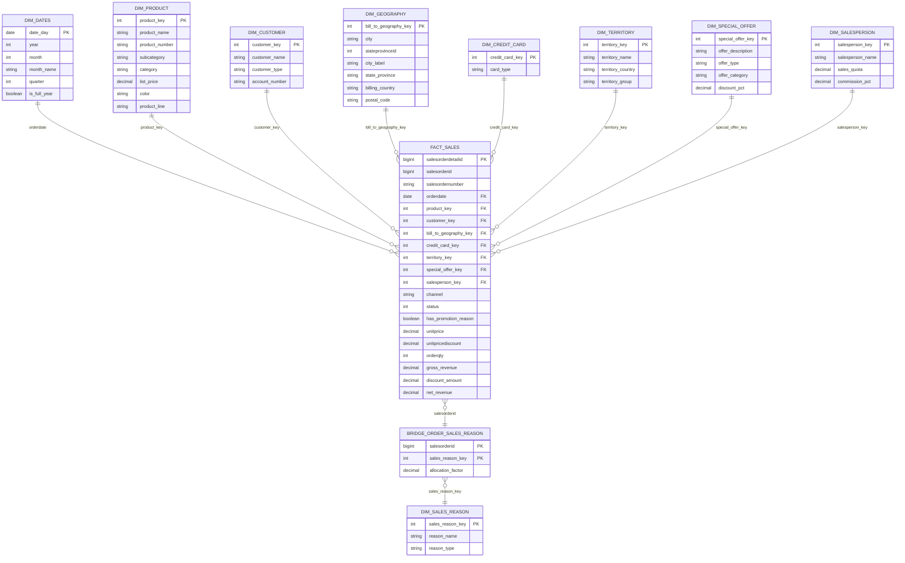

# Decisões de modelagem — Etapa 3

Especificação técnica do modelo desenhado em
[`03.01-modelo-conceitual.md`](03.01-modelo-conceitual.md). Aquele é o entregável do
briefing — a estrela e o mapeamento de fontes. Este é o que o projeto dbt da Etapa 5 vai
seguir, e a matéria-prima da documentação de regras de negócio da Etapa 8.

As duas decisões de fundo foram registradas **antes** de qualquer contato com material de
avaliação, e saem de quatro fontes: o briefing do desafio, o
[`indicium-code-style`](https://github.com/indiciumtech/indicium-code-style) (público), o
referencial de processos da Indicium AI, e medição direta nos CSVs da base.

## Decisão 1 — grão da tabela fato

**Uma `fact_sales`, no grão do item de pedido.** PK `salesorderdetailid`.

| Evidência | Fonte |
|---|---|
| O briefing diz **"a tabela fato"**, no singular, nas quatro vezes em que a menciona — no item 3 e três vezes na lista de demonstrações do vídeo | briefing, itens 3 e 9 |
| Exige **teste de PK** na fato; o item tem PK natural, o pedido só serve à outra fato | briefing, item 5 |
| O número de aceite do CEO, **US$ 12.646.112,16**, é `orderqty * unitprice` — receita **bruta**, que só existe no item. O `subtotal` do pedido é a líquida, `12.641.672,2130` | medido nos CSVs |
| A pergunta (b) define `receita bruta − descontos de produto / nº de pedidos` — as duas parcelas são colunas do item | briefing, pergunta (b) |
| Nenhuma das seis perguntas usa `freight`, `taxamt` ou `totaldue` | briefing, perguntas (a)–(f) |

**Fora da fato, deliberadamente:** `freight`, `taxamt` e `totaldue` são do pedido e valem
10,9% do `totaldue` (US$ 13,4 mi). Ficam de fora porque nenhuma pergunta os usa — não por
esquecimento. Documentar na Etapa 8.

**Consequência operacional:** a contagem de pedidos é `count(distinct salesorderid)` sobre a
fato de item.

### Por que não duas fatos

Cabeçalho e linha foi a primeira recomendação, e foi retirada. O briefing pede uma; e duas
fatos compartilhando `dim_produto`, `dim_data` e `dim_cliente` criariam o relacionamento
circular que o documento `5.4) Boas práticas envolvendo tabelas bridges` do referencial
descreve como problema a evitar no Power BI. Uma fato elimina o problema inteiro.

## Decisão 2 — tratamento de `SalesReason`

**`dim_sales_reason` + `bridge_order_sales_reason`**, ligada por `salesorderid`, mais
`has_promotion_reason` degenerada na fato.

O que o dado é, medido nos CSVs:

| Fato | Número |
|---|---|
| Pedidos com motivo | 23.012 de 31.465 (73,1%) |
| Com 1 motivo / 2 / 3 | 80,5% / 18,8% / 0,7% |
| Cobertura no online | 83,2% |
| Cobertura na revenda | **0%** — nenhum dos 3.806 pedidos |
| Receita da revenda | 73% do total |
| Inflação ao somar receita através da ponte | **US$ 8.426.399,95** (+29%) |

**Por que ponte e não um motivo por pedido:** para 4.482 pedidos seria preciso inventar uma
regra de prioridade que a origem não oferece — não há coluna de ordem, peso ou "principal".
A informação descartada não volta.

**Por que `has_promotion_reason` também:** a pergunta (f) é a única das seis que é *sobre* motivo, e
assim ela se responde sem atravessar a ponte — que é o que se demonstra no vídeo.

**Membro "Não informado" é obrigatório** em `dim_sales_reason`: sem ele, os 26,9% sem motivo
e os 100% da revenda somem de qualquer visual filtrado por motivo, e somem justamente no
dashboard, onde ninguém confere.

**Regra que precisa estar escrita:** receita mora na fato; a ponte filtra e fatia, nunca se
soma através dela.

## Nomenclatura

`bridge_`, conforme `dbt_coding_conventions.md` (linha 218), que é o repositório normativo
que o briefing manda seguir. O referencial usa `bdg_` no documento `5.4)` — há divergência
entre os dois documentos da casa, e esta é a escolha, não um descuido.

Vale notar que o `bdg_` do referencial descreve **outra coisa**: uma ponte entre múltiplas
fatos para resolver relacionamento circular no BI, construída com `full outer join`. O que
esta decisão usa é a ponte de "muitos para muitos" entre fato e dimensão.

## O detalhe: colunas e chaves

### O papel de cada coluna da fato

O diagrama mostra os nomes; o que distingue as colunas é o **papel**, e é ele que decide o
que pode ser somado.

| Coluna | Papel | Observação |
|---|---|---|
| `salesorderdetailid` | **PK** | o grão: um item de pedido, 121.317 linhas |
| `salesorderid` | degenerada | obrigatória: três das seis perguntas contam pedidos, e é a ligação com a ponte |
| `salesordernumber` | degenerada | o número que o negócio usa |
| `orderdate` | FK **e** coluna física `date` | física para o teste do CEO não precisar de join |
| `product_key` … `salesperson_key` | FK | oito chaves, uma por dimensão |
| `channel` | degenerada | `online` ou `revenda`, de `onlineorderflag` — o eixo de controle de toda análise |
| `status` | degenerada | constante `5` na base inteira, com rótulo mapeado |
| `has_promotion_reason` | degenerada | atalho para a pergunta (f) sem atravessar a ponte |
| `unitprice` | **atributo** | preço unitário: somar não significa nada |
| `unitpricediscount` | **atributo** | é taxa, de 0 a 1: somar não significa nada |
| `orderqty` | métrica | unidades |
| `gross_revenue` | métrica | `orderqty * unitprice` — é o que o CEO acompanha |
| `discount_amount` | métrica | `gross_revenue − net_revenue` |
| `net_revenue` | métrica | `linetotal` da origem |

As duas linhas marcadas como **atributo** são o motivo desta tabela existir: elas parecem
métricas, têm tipo numérico e, arrastadas para um cartão, produzem um número que não quer
dizer nada. Na camada semântica do Power BI elas ficam marcadas como não somáveis.

## Quatro correções que a revisão do desenho encontrou

### 1. A ponte cobre os 31.465 pedidos, não os 23.012 com motivo

`salesorderheadersalesreason` só tem linha para pedido que **tem** motivo. Os outros 8.453
(26,9%, entre eles **100% da revenda**, que é 73% da receita) não existem nela. Se a ponte
fosse cópia da origem, o membro "Não informado" da dimensão existiria e **nada casaria com
ele** — a maior parte do faturamento sumiria de qualquer visual filtrado por motivo.

A ponte é construída como a origem **`union all`** os pedidos ausentes, com
`sales_reason_key = -1`.

### 2. `allocation_factor`, e as duas medidas que ele permite

A pergunta (a) pede valor total **por motivo da venda**. Somar receita através da ponte
infla o resultado em **US$ 8.426.399,95** (+29%), porque 19,5% dos pedidos com motivo têm
mais de um. Com `allocation_factor = 1.0 / count(*) over (partition by salesorderid)`
nascem duas medidas, e a escolha entre elas passa a ser explícita:

| Medida | Usa o fator | Soma ao total? | Para quê |
|---|---|---|---|
| `revenue_by_reason` | não | **não** | comparar motivos entre si |
| `allocated_revenue_by_reason` | sim | **sim** | responder a pergunta (a) |

### 3. Membro desconhecido em três dimensões, e o maior deles é o vendedor

| Dimensão | Casos sem valor | O que significa |
|---|---|---|
| `dim_salesperson` | **27.659 de 31.465 (87,9%)** | coincide **exatamente** com os pedidos online: não é dado faltante, é o canal |
| `dim_sales_reason` | 8.453 pedidos (26,9%) | motivo não registrado; toda a revenda |
| `dim_credit_card` | 1.131 pedidos | pagamento sem cartão |

Sem o membro `-1`, filtrar por vendedor apaga o varejo inteiro — 88% dos pedidos.

### 4. Cidade tem chave composta

São **575** nomes distintos de cidade contra **613** pares (cidade, estado): 38 cidades
existem em mais de um estado. Agrupar pelo nome as funde. A dimensão expõe `city_key` =
cidade + `stateprovinceid`, e um rótulo `"Cidade, UF"` para a tela.

Conferido: o top 5 da pergunta (d) **não muda** com a correção — as homônimas não estão no
topo.

## Decisões menores, escritas para não virarem escolha implícita

**Geografia é de cobrança.** `bill_to_geography_key` vem de `billtoaddressid`. Medido:
bill-to e ship-to diferem em apenas **99 de 31.465 pedidos (0,31%)**, então não há dimensão
de papel duplo. O nome do campo carrega o `bill_to` para ninguém ler "cidade do cliente" —
que, aliás, seria um terceiro endereço, via `businessentityaddress`, fora do escopo.

**Nome do cliente:** `coalesce(store.name, firstname || ' ' || lastname)`. Loja tem
prioridade, e `customer_type` diz qual dos dois caminhos valeu.

**`dim_product` mantém os 504 produtos**, incluindo os **238 que nunca venderam**, com
membro "Sem subcategoria" para os 209 sem classificação. Um `inner join` com subcategoria os
eliminaria, e a constatação de que 47% do catálogo não vende deixaria de ser respondível —
ela exige linha de dimensão sem linha de fato.

**Dois países, nomeados distintamente.** `dim_geography.billing_country` e
`dim_territory.territory_country` descrevem a mesma venda e não são a mesma coisa. Sem nomes
distintos, o dashboard mostra dois "Canadá" com números diferentes.

**`has_promotion_reason`**, e não `has_promotion`: ela vem do **motivo de venda**, não da
oferta de `dim_special_offer`. São coisas diferentes, e o nome curto confundiria as duas.

**Ticket médio por produto** tem denominador "pedidos que contêm o produto". A soma dos
numeradores por produto dá o total; a dos denominadores não. A medida precisa de nome que
revele isso, senão a tela mente.

**`status`** é constante `5` em toda a base e ganha rótulo mapeado no modelo — não há tabela
de origem para ele.

## As seis perguntas, com o caminho

| # | Pergunta | Caminho |
|---|---|---|
| (a) | pedidos, quantidade e valor por 9 cortes | fato → cada dimensão; o corte por **motivo** usa a ponte com `allocated_revenue_by_reason` |
| (b) | maior valor médio por pedido, por produto | fato → `dim_product` · `dim_dates` · `dim_geography` |
| (c) | top 10 clientes | fato → `dim_customer`, filtrável pelas demais |
| (d) | top 5 cidades | fato → `dim_geography`, por `city_key` |
| (e) | série por mês e ano | fato → `dim_dates` |
| (f) | produto com mais unidades em "Promotion" | fato → ponte → `dim_sales_reason` filtrado, `sum(orderqty)` por produto; ou direto pela degenerada |

A (a) é a única que depende da ponte para fechar, e é por isso que o `allocation_factor`
existe.

## O que a fato tem de reproduzir

O aceite do CEO: **US$ 12.646.112,16** de receita **bruta** em 2011. Em `fact_sales` é
`sum(gross_revenue)` com `year(orderdate) = 2011`, sem filtro de status. O valor exato tem
quatro casas — `12.646.112,1607` — e é por isso que o dinheiro é `decimal(19, 4)` desde a
camada bruta, nunca `double`.
