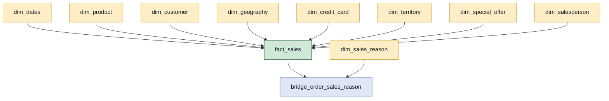

# Modelo conceitual — Etapa 3

Star schema para a área comercial da Adventure Works. Uma tabela fato, nove dimensões e uma
ponte, construídos sobre as **17 tabelas** do escopo de análise da camada bruta.

As decisões de fundo — grão da fato e tratamento do motivo de venda — estão em
[`03-decisoes-de-modelagem.md`](03-decisoes-de-modelagem.md), com a evidência de cada uma.
Este documento é o desenho que decorre delas.

> Os nomes dos modelos estão em **inglês**, seguindo as tabelas de origem, os exemplos do
> `dbt_coding_conventions` (`fact_orders`) e o `dim_dates` do referencial da casa. A prosa
> segue em português.

## A estrela

A fato está no **grão do item de pedido**: uma linha por produto dentro de um pedido,
121.317 ao todo. É o grão mais fino disponível, e é o único em que a receita bruta de 2011
— os US$ 12.646.112,16 que o CEO acompanha — pode ser reproduzida.

Oito dimensões ligam-se direto à fato. O motivo da venda é o único caso de **muitos para
muitos**: um pedido pode ter até três motivos, e somá-los direto inflaria a receita. Por
isso ele passa por uma **ponte**, em azul, em vez de virar coluna da fato.

## Mapeamento de fontes

Quais tabelas da camada bruta originam cada modelo. As **17 do escopo** são usadas, sem
sobra e sem falta.

| Modelo | Tabelas de origem |
|---|---|
| `fact_sales` | `salesorderdetail` · `salesorderheader` |
| `dim_product` | `product` · `productsubcategory` · `productcategory` |
| `dim_customer` | `customer` · `person` · `store` |
| `dim_geography` | `address` · `stateprovince` · `countryregion` |
| `dim_credit_card` | `creditcard` |
| `dim_territory` | `salesterritory` |
| `dim_special_offer` | `specialoffer` |
| `dim_salesperson` | `salesperson` · `person` |
| `dim_sales_reason` | `salesreason` |
| `bridge_order_sales_reason` | `salesorderheadersalesreason` · `salesorderheader` |
| `dim_dates` | **nenhuma** — gerada com `dbt_utils.date_spine` |

`dim_dates` não tem origem de propósito: o padrão da casa (ADR013, documento
`2.3) Como construir e utilizar a dim_dates`) é gerá-la pela macro, e não derivá-la das
datas observadas. Assim o calendário não tem buracos nos meses sem venda.

`bridge_order_sales_reason` usa `salesorderheader` além da tabela de ponte da origem: a
ponte da origem só tem linha para pedido que **tem** motivo, e os 8.453 restantes precisam
entrar com um motivo "Não informado" para não sumirem das análises.

## Onde está o resto

Este documento é o modelo. O detalhamento vive em
[`03-decisoes-de-modelagem.md`](03-decisoes-de-modelagem.md), no mesmo repositório:
colunas e chaves de cada tabela, o papel de cada coluna da fato — o que é métrica, o que é
degenerada e o que não pode ser somado —, as quatro decisões de desenho com a medição que
sustenta cada uma, e o caminho de join de cada uma das seis perguntas de negócio.
