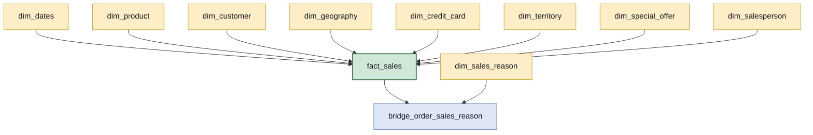
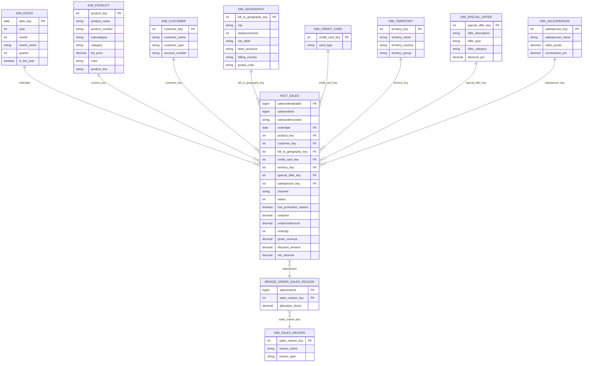

# Modelo conceitual — Etapa 3

Star schema para a área comercial da Adventure Works. Uma tabela fato, nove dimensões e uma
ponte, construídos sobre as **17 tabelas** do escopo de análise da camada bruta.

As decisões de fundo — grão da fato e tratamento do motivo de venda — estão em
[`03-decisoes-de-modelagem.md`](03-decisoes-de-modelagem.md), com a evidência de cada uma.
Este documento é o desenho que decorre delas.

> Os nomes dos modelos estão em **inglês**, seguindo as tabelas de origem, os exemplos do
> `dbt_coding_conventions` (`fact_orders`) e o `dim_dates` do referencial da casa. A prosa
> segue em português.

## A estrela

Oito dimensões ligam-se direto à fato. O motivo da venda é o único caso de **muitos para
muitos** — um pedido pode ter até três motivos — e por isso passa por uma ponte em vez de
virar coluna. A justificativa está na seção das decisões.

## O detalhe: colunas e chaves

### O papel de cada coluna da fato

O diagrama mostra os nomes; o que distingue as colunas é o **papel**, e é ele que decide o
que pode ser somado.

| Coluna | Papel | Observação |
|---|---|---|
| `salesorderdetailid` | **PK** | o grão: um item de pedido, 121.317 linhas |
| `salesorderid` | degenerada | obrigatória: três das seis perguntas contam pedidos, e é a ligação com a ponte |
| `salesordernumber` | degenerada | o número que o negócio usa |
| `orderdate` | FK **e** coluna física `date` | física para o teste do CEO não precisar de join |
| `product_key` … `salesperson_key` | FK | oito chaves, uma por dimensão |
| `channel` | degenerada | `online` ou `revenda`, de `onlineorderflag` — o eixo de controle de toda análise |
| `status` | degenerada | constante `5` na base inteira, com rótulo mapeado |
| `has_promotion_reason` | degenerada | atalho para a pergunta (f) sem atravessar a ponte |
| `unitprice` | **atributo** | preço unitário: somar não significa nada |
| `unitpricediscount` | **atributo** | é taxa, de 0 a 1: somar não significa nada |
| `orderqty` | métrica | unidades |
| `gross_revenue` | métrica | `orderqty * unitprice` — é o que o CEO acompanha |
| `discount_amount` | métrica | `gross_revenue − net_revenue` |
| `net_revenue` | métrica | `linetotal` da origem |

As duas linhas marcadas como **atributo** são o motivo desta tabela existir: elas parecem
métricas, têm tipo numérico e, arrastadas para um cartão, produzem um número que não quer
dizer nada. Na camada semântica do Power BI elas ficam marcadas como não somáveis.

## Mapeamento de fontes

Quais tabelas da camada bruta originam cada modelo. As **17 do escopo** são usadas, sem
sobra e sem falta.

| Modelo | Tabelas de origem |
|---|---|
| `fact_sales` | `salesorderdetail` · `salesorderheader` |
| `dim_product` | `product` · `productsubcategory` · `productcategory` |
| `dim_customer` | `customer` · `person` · `store` |
| `dim_geography` | `address` · `stateprovince` · `countryregion` |
| `dim_credit_card` | `creditcard` |
| `dim_territory` | `salesterritory` |
| `dim_special_offer` | `specialoffer` |
| `dim_salesperson` | `salesperson` · `person` |
| `dim_sales_reason` | `salesreason` |
| `bridge_order_sales_reason` | `salesorderheadersalesreason` · `salesorderheader` |
| `dim_dates` | **nenhuma** — gerada com `dbt_utils.date_spine` |

`dim_dates` não tem origem de propósito: o padrão da casa (ADR013, documento
`2.3) Como construir e utilizar a dim_dates`) é gerá-la pela macro, e não derivá-la das
datas observadas. Assim o calendário não tem buracos nos meses sem venda.

`bridge_order_sales_reason` usa `salesorderheader` além da tabela de ponte da origem, e o
motivo está na seção seguinte.

## As quatro decisões que o desenho carrega

### 1. A ponte cobre os 31.465 pedidos, não os 23.012 com motivo

`salesorderheadersalesreason` só tem linha para pedido que **tem** motivo. Os outros 8.453
(26,9%, entre eles **100% da revenda**, que é 73% da receita) não existem nela. Se a ponte
fosse cópia da origem, o membro "Não informado" da dimensão existiria e **nada casaria com
ele** — a maior parte do faturamento sumiria de qualquer visual filtrado por motivo.

A ponte é construída como a origem **`union all`** os pedidos ausentes, com
`sales_reason_key = -1`.

### 2. `allocation_factor`, e as duas medidas que ele permite

A pergunta (a) pede valor total **por motivo da venda**. Somar receita através da ponte
infla o resultado em **US$ 8.426.399,95** (+29%), porque 19,5% dos pedidos com motivo têm
mais de um. Com `allocation_factor = 1.0 / count(*) over (partition by salesorderid)`
nascem duas medidas, e a escolha entre elas passa a ser explícita:

| Medida | Usa o fator | Soma ao total? | Para quê |
|---|---|---|---|
| `revenue_by_reason` | não | **não** | comparar motivos entre si |
| `allocated_revenue_by_reason` | sim | **sim** | responder a pergunta (a) |

### 3. Membro desconhecido em três dimensões, e o maior deles é o vendedor

| Dimensão | Casos sem valor | O que significa |
|---|---|---|
| `dim_salesperson` | **27.659 de 31.465 (87,9%)** | coincide **exatamente** com os pedidos online: não é dado faltante, é o canal |
| `dim_sales_reason` | 8.453 pedidos (26,9%) | motivo não registrado; toda a revenda |
| `dim_credit_card` | 1.131 pedidos | pagamento sem cartão |

Sem o membro `-1`, filtrar por vendedor apaga o varejo inteiro — 88% dos pedidos.

### 4. Cidade tem chave composta

São **575** nomes distintos de cidade contra **613** pares (cidade, estado): 38 cidades
existem em mais de um estado. Agrupar pelo nome as funde. A dimensão expõe `city_key` =
cidade + `stateprovinceid`, e um rótulo `"Cidade, UF"` para a tela.

Conferido: o top 5 da pergunta (d) **não muda** com a correção — as homônimas não estão no
topo.

## Decisões menores, escritas para não virarem escolha implícita

**Geografia é de cobrança.** `bill_to_geography_key` vem de `billtoaddressid`. Medido:
bill-to e ship-to diferem em apenas **99 de 31.465 pedidos (0,31%)**, então não há dimensão
de papel duplo. O nome do campo carrega o `bill_to` para ninguém ler "cidade do cliente" —
que, aliás, seria um terceiro endereço, via `businessentityaddress`, fora do escopo.

**Nome do cliente:** `coalesce(store.name, firstname || ' ' || lastname)`. Loja tem
prioridade, e `customer_type` diz qual dos dois caminhos valeu.

**`dim_product` mantém os 504 produtos**, incluindo os **238 que nunca venderam**, com
membro "Sem subcategoria" para os 209 sem classificação. Um `inner join` com subcategoria os
eliminaria, e a constatação de que 47% do catálogo não vende deixaria de ser respondível —
ela exige linha de dimensão sem linha de fato.

**Dois países, nomeados distintamente.** `dim_geography.billing_country` e
`dim_territory.territory_country` descrevem a mesma venda e não são a mesma coisa. Sem nomes
distintos, o dashboard mostra dois "Canadá" com números diferentes.

**`has_promotion_reason`**, e não `has_promotion`: ela vem do **motivo de venda**, não da
oferta de `dim_special_offer`. São coisas diferentes, e o nome curto confundiria as duas.

**Ticket médio por produto** tem denominador "pedidos que contêm o produto". A soma dos
numeradores por produto dá o total; a dos denominadores não. A medida precisa de nome que
revele isso, senão a tela mente.

**`status`** é constante `5` em toda a base e ganha rótulo mapeado no modelo — não há tabela
de origem para ele.

## As seis perguntas, com o caminho

| # | Pergunta | Caminho |
|---|---|---|
| (a) | pedidos, quantidade e valor por 9 cortes | fato → cada dimensão; o corte por **motivo** usa a ponte com `allocated_revenue_by_reason` |
| (b) | maior valor médio por pedido, por produto | fato → `dim_product` · `dim_dates` · `dim_geography` |
| (c) | top 10 clientes | fato → `dim_customer`, filtrável pelas demais |
| (d) | top 5 cidades | fato → `dim_geography`, por `city_key` |
| (e) | série por mês e ano | fato → `dim_dates` |
| (f) | produto com mais unidades em "Promotion" | fato → ponte → `dim_sales_reason` filtrado, `sum(orderqty)` por produto; ou direto pela degenerada |

A (a) é a única que depende da ponte para fechar, e é por isso que o `allocation_factor`
existe.

## O que a fato tem de reproduzir

O aceite do CEO: **US$ 12.646.112,16** de receita **bruta** em 2011. Em `fact_sales` é
`sum(gross_revenue)` com `year(orderdate) = 2011`, sem filtro de status. O valor exato tem
quatro casas — `12.646.112,1607` — e é por isso que o dinheiro é `decimal(19, 4)` desde a
camada bruta, nunca `double`.
