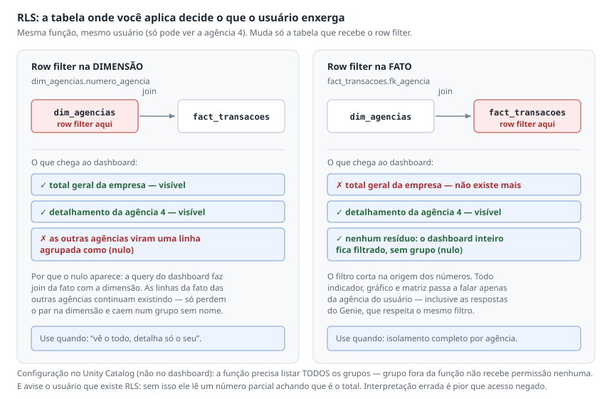

# Resumo — Módulo 9: Aulas do Módulo (AI/BI Databricks)

> 13 aulas (~3,1 h). Constrói um dashboard completo no **AI/BI do Databricks** para o cliente
> fictício **Banco BanVic** — os mesmos dados do módulo de Power BI — e vai até governança (RLS,
> mascaramento) e treinamento da IA **Genie**.
>
> Referências como `(A04)` apontam a aula de origem.

## 1. Começar pelos objetivos, não pela ferramenta

A aula abre repetindo a etapa de discovery: antes de criar dashboard é preciso saber objetivos dos
usuários, requisitos e regras de negócio `(A01)`.

Os objetivos da gerência de operações do BanVic — que guiam **todas** as decisões visuais depois:

| # | Necessidade |
|---|---|
| 1 | Valor total, quantidade e média do valor das transações **ao longo do tempo** |
| 2 | Quais agências tiveram mais transações **em quantidade** |
| 3 | Valor total e quantidade transacionada **por tipo de operação** |
| 4 | Detalhamento dos indicadores **por agência** |

Guarde essa lista: ela reaparece como critério de decisão em cada aula (por que dois gráficos numa
página e não quatro, por que uma segunda página, qual coluna destacar na matriz).

## 2. A diferença fundamental: SQL no lugar do modelo semântico

Este é **o** conceito que separa o AI/BI de outras ferramentas de BI `(A02)`.

| | Power BI e similares | AI/BI Databricks |
|---|---|---|
| Relacionamento dim ↔ fato | Modelado **dentro** da ferramenta | Não existe modelagem na ferramenta |
| Como você junta os dados | Relacionamentos + DAX | **Uma query SQL** (`create from SQL`) |
| O que o dashboard consome | O modelo semântico | **O dataset da query**, não as tabelas soltas |

O fluxo: `data` → `add data source` → escolher tabelas do **Unity Catalog** (também aceita upload de
CSV/XML) → `create from SQL` → escrever o join conforme a necessidade da análise.

Três hábitos que a aula ensina no caminho:

- **Comentar os objetivos dentro da query.** Serve para não perder de vista quais colunas e tabelas
  são realmente necessárias enquanto você escreve.
- **Não deixar `SELECT *`.** Trocar pela lista explícita de colunas necessárias.
- **Apagar as tabelas soltas do dataset** depois de criar a query — o dashboard usa a query.

> **`dev` vs `prod`:** a aula usa o esquema `dev` para demonstrar, mas repete várias vezes que em
> projeto real se usa **produção** — é isso que garante que atualização de dado reflita no BI
> `(A02, A10, A12)`.

## 3. Cálculos customizados (as "medidas" do AI/BI)

Permitem criar medidas **sem escrever SQL de agregação** `(A02)`. As três do dashboard:

| Medida | Expressão |
|---|---|
| Quantidade de transações | `COUNT(DISTINCT numero_transacao)` |
| Valor total das transações | `SUM(valor_transacao)` |
| Média do valor de transação | `AVG(valor_transacao)` |

**Pegadinha:** o campo de comentário do cálculo parece opcional e não é. Ele funciona como a
descrição de uma coluna — e é lido pela **IA Genie** para entender o que a medida significa. Comentar
mal aqui degrada as respostas da IA depois `(A02)`.

## 4. Tema, contraste e cabeçalho

Configurações globais ficam na aba direita: tema, cor de fonte, tipografia, background, cor dos
widgets, borda, cor de seleção, alinhamento e cores customizadas `(A03)`.

> **Testar o dark mode não é capricho.** Muitos usuários usam o Databricks em modo escuro, e a aula
> insiste em verificar se as cores escolhidas mantêm bom contraste nas duas versões. É verificação
> de acessibilidade, não de estética.

**As primeiras cores da lista customizada viram o padrão dos gráficos** — vale ordenar
intencionalmente em vez de deixar o default.

O canvas é **modular** (grade), então widget e gráfico se ajustam à grade. O cabeçalho é montado com
caixa de texto e leva:

- Título e subtítulo (formatação de título, negrito, centralizado)
- **Link** para documentação externa ou regras de negócio documentadas à parte
- **Logotipo** via URL pública, ou arquivo em Drive/SharePoint com link público
- Os filtros

Três filtros, escolhidos a partir dos objetivos: **data** (range), **agência** (múltipla) e
**estado** (múltipla, por UF).

> **Quais filtros existir é decisão conjunta com o usuário, na etapa de mockup** — não é escolha do
> desenvolvedor no meio da construção `(A03)`.

## 5. Os visuais

### Counters (os big numbers)

O valor pode vir de **medida calculada** ou de **coluna com agregação implícita** (contagem, média,
soma) — a aula mostra os dois caminhos `(A04)`.

Recursos que valem lembrar:

| Recurso | Detalhe |
|---|---|
| Tamanho da fonte e abreviação | `style` → compacto, ou `None` para número completo |
| Posição do título | **Automática pela forma do widget** — alongado põe ao lado, quadrado põe acima |
| Clonar formatação | `Ctrl+C` / `Ctrl+V` e só trocar o dado |
| `target` | Campo de meta, se o dataset tiver |
| **Descrição** | Vira **tooltip automaticamente** quando não há espaço no widget |
| Destaque | Background de outra cor, ou cor condicional no dado |

A descrição é subestimada: é onde entra regra de negócio ou qual filtro está aplicado naquele
indicador.

### Gráfico de linha e o eixo duplo

Linha para série temporal. No eixo X, a data com granularidade escolhida (`yearly` no caso, porque
**foi combinado com o usuário**) `(A04)`.

**Pegadinha:** o AI/BI **não tem hierarquia de datas**, então não existe drill down / drill up. A
granularidade é decidida na configuração do gráfico. A Databricks tem a feature mapeada no roadmap,
mas na versão da aula não existe.

Para dois indicadores de escalas diferentes no mesmo gráfico, é obrigatório **`enable dual axis`** —
sem isso a escala fica errada e o gráfico mente.

> **O insight que a aula constrói ao vivo:** a quantidade de transações sobe enquanto o valor médio
> cai. Pergunta natural: entraram novos clientes? Adiciona a contagem distinta de `fk_cliente` no
> gráfico e confirma a elevação. Vale como método — o gráfico gera a pergunta seguinte `(A04)`.

`display name` renomeia a legenda, que por padrão vem como `Count of Unique ...`.

### Barras

Eixo X categórico. Quando o nome da agência fica ilegível, a solução **não** é aumentar o gráfico e
ocupar o dashboard — é **trocar os eixos** e deixar horizontal `(A04)`.

Formatações: ordem decrescente pelo eixo, rótulos de dados, e formatação customizada para usar
**ponto** como separador de grupo sem abreviação.

**Pegadinha:** dá para empilhar um segundo indicador e dá para usar faixa de cor como terceira
informação — e a aula mostra as duas coisas **para depois removê-las**. O critério: o objetivo do
gráfico é mostrar qual agência se destaca em quantidade. Informação a mais que não serve ao objetivo
é sobrecarga, não riqueza.

### Matriz (pivot)

O visual certo quando é preciso reunir **todos** os indicadores por agência `(A04)`.

| Área | Uso |
|---|---|
| `rows` | As agências (as linhas da matriz) |
| `columns` | Agrupamento opcional (por ano, por exemplo) |
| `values` | Os três indicadores |

Por padrão os valores vêm organizados em linhas; para virar colunas é nos três pontos de `values`.
Formatar cada medida (R$, separador de grupos) e ordenar decrescente por valor total. `display total`
na formatação de `rows` acrescenta o total.

> **Formatação condicional é escolha, não enfeite:** "se tudo tiver destaque, não damos ênfase a
> nenhum dado". A aula aplica escala de cor em **uma** coluna — média do valor — justificando pelo
> negócio: ela mostra quais agências concentram valores altos e quais têm transações pulverizadas
> `(A04)`.

## 6. Diagramação e quando criar outra página

Os gráficos de linha ficaram apertados e passaram a ocupar a largura toda — evolução ano a ano
precisa de espaço `(A04)`.

O critério para a segunda página é conceitual, não de espaço:

```
Informações que se complementam  -> mesma página
Aprofundamento de um indicador   -> página separada
Análise não ligada ao que já foi construído -> página separada
```

E um atalho prático: em vez de abrir página em branco, **clone a primeira página** e apague os
visuais — você reaproveita cabeçalho, logotipo e filtros prontos.

Na segunda página ("tipos de transação"), dois cuidados novos: valores **negativos** aparecem
naturalmente por tipo de operação, e `display name` + **tooltips** adicionais (média do valor)
deixam o hover legível.

**Testar os filtros antes de publicar** revelou um defeito real: o filtro de data vinha com
granularidade de **hora**; trocar para `daily` resolveu. Os filtros são **por página**; filtro global
é configurado à parte e vale para todas. O filtro de data tem presets (últimos 7 dias, esse mês,
esse ano…).

## 7. Publicar: a decisão de permissão que importa

Ao publicar, escolhe-se entre duas configurações — e essa é a decisão de governança mais importante
do subcurso `(A05)`.

| | **Share data permission** (padrão) | **Individual data permission** |
|---|---|---|
| As queries rodam com | As permissões **do editor** (você) | As credenciais **de cada usuário** |
| O usuário precisa de acesso aos dados? | Não | **Sim**, você tem que garantir antes |
| Vantagem | **Cache compartilhado** — melhora a performance | Respeita a segurança de dados |
| Custo | Divulgar mais do que o usuário deveria ver | **Refresh mais frequente** + preparar acesso por pessoa |
| Risco | Divulgar mais do que o usuário deveria ver | Exige preparo de acesso por pessoa |

**Pegadinha grave:** no modo padrão, **a RLS é contornada**. Se você tem RLS aplicada para
determinados usuários, eles vão ver os dados de qualquer forma, porque estão olhando o dashboard com
as **suas** permissões. A aula usa o modo padrão só porque são dados de demonstração e afirma que
**em produção a opção mais segura costuma ser `individual`**.

A caixa de publicação explicita o mecanismo de cada modo, e é aí que a decisão fica clara:
o modo padrão faz todos os leitores usarem **as suas** permissões, o que habilita um **cache
compartilhado**; o modo individual faz cada leitor rodar com as próprias credenciais, o que
leva a **operações de refresh mais frequentes**. Ou seja, o trade-off não é só de governança —
é também de performance e custo de execução.

Na mesma caixa ficam o checkbox **Notify viewers**, o **Copy link** e o botão **Unpublish**,
que despublica sem apagar o dashboard.

Publicado, dá para exportar em PDF e **exportar visual por visual** (para apresentação, Excel ou
CSV).

> **A publicação é também o teste de layout:** só no publicado apareceram o logotipo grande demais
> (com barra de rolagem) e o título cortado. A correção foi aumentar o espaço do cabeçalho e reduzir
> o título `(A05)`.

## 8. Compartilhamento e permissões

Compartilha-se por usuário ou grupo, e há a opção ampla **anyone in my account can view** — vale
para todos os usuários registrados na conta Databricks, **mesmo fora do workspace original**, desde
que tenham conta ativa `(A06)`.

Também é possível **incorporar** o dashboard em intranet ou SharePoint (`embed dashboard`).

**Pegadinha:** normalmente o usuário ainda precisa fazer login no Databricks — **exceto** se o
dashboard foi publicado com as suas credenciais. Nesse caso, incorporado num sistema externo, basta
o acesso ao sistema externo. É a combinação que **expõe dados a quem não deveria ter acesso às
fontes**. Usar com atenção `(A06)`.

### Os quatro níveis de permissão

| Permissão | O que libera |
|---|---|
| `Can View` | Só visualizar — **não pode perguntar ao Genie** |
| `Can Run` | Atualizar o dashboard e executar queries |
| `can edit` | Editar layout, consultas e criar visualizações |
| `manage` | Controle total, incluindo exclusão e gestão de compartilhamento |

### As três camadas de acesso

Para o usuário ver e interagir, ele precisa de **todas** as três `(A07)`:

```
1. acesso ao objeto do dashboard
2. leitura nas tabelas/views do Unity Catalog
3. acesso ao SQL Warehouse (can use warehouse)
```

Se o dashboard for publicado com as suas credenciais, as camadas 2 e 3 caem — mas o usuário **ainda
precisa de conta no Databricks**.

## 9. Agendamento de atualização

Por padrão, as consultas rodam **sob demanda**: abrir o dashboard ou mexer num filtro dispara a
query no SQL Warehouse na hora. Então por que agendar? `(A08)`

| Benefício | Mecanismo |
|---|---|
| **Desempenho** | Pré-carrega as consultas e popula o cache de resultados |
| **Consistência** | Todos veem os mesmos dados até o próximo refresh |
| **Custo** | 100 usuários clicando não disparam 100 execuções — roda uma vez no horário |

O argumento de custo é o mais forte: sem agendamento, cada clique reexecuta a query.

Na mesma janela ficam os **subscribers**, que recebem por e-mail imagem estática + PDF a cada
atualização.

**Pegadinha:** se o dashboard tem mais de uma página, o e-mail leva **só a primeira**. E a aula
questiona o próprio recurso: refresh diário → assinatura é bom lembrete; refresh a cada minuto →
enxurrada de e-mail. "Nem todo recurso serve para todos os casos."

## 10. Alertas

O passo que quase todo mundo erra: **alerta não é criado no dashboard nem no widget**. É criado na
aba de alertas — e antes dele é preciso uma **query** `(A09)`.

O exemplo: alertar quando a quantidade de transações cair mais de 50% de um mês para o outro.

```
CTE transacoes_dezembro  -> conta transações distintas do período
CTE transacoes_janeiro   -> conta transações distintas do período
CTE percentual           -> join das duas + variação percentual
SELECT principal         -> devolve o valor como texto, LIMITADO A UMA LINHA
```

A restrição a **uma linha** não é detalhe estético: é o que permite configurar a condição com a
opção **`First row`**. Condição do exemplo: coluna `percentual` `<= -50`.

O formulário do alerta se lê como uma frase, e cada peça é um campo:

```
Trigger condition:  [Value column]  [First row]  [Operator]  [Threshold value]
                     percentual                      <=            -50
```

> **O caso de borda que ninguém lembra:** existe um campo *When query result has no rows, set
> state to* — e o padrão é **`UNKNOWN`**. Query sem linha não significa "está tudo bem": o alerta
> fica num terceiro estado, nem disparado nem normal. Se a sua query pode não retornar nada,
> decida conscientemente o que isso quer dizer.

Nas notificações dá para escolher enviar **`just once` até voltar ao normal** — e, separadamente,
**notificar quando o alerta volta ao normal**, que é o aviso de que o problema passou.

> **A dependência que quebra o alerta:** o alerta **não dispara fora do agendamento da query**. A
> query precisa ter rodado naquele agendamento. Logo, agende a query **antes** do alerta — no
> exemplo, query 17:30 e alerta 18:00. Alerta agendado antes da query não tem dado para avaliar
> `(A09)`.

O template de e-mail é customizável com HTML e variáveis — e **o link para o dashboard não é
nativo**, tem que ser incluído à mão. Dica de teste: aproxime os dois agendamentos para ver o e-mail
chegar.

## 11. Governança: RLS e mascaramento de colunas

**RLS** (*row level security*) restringe **linhas** conforme a identidade de quem consulta, aplicando
o **princípio do privilégio mínimo** `(A10)`.

Configura-se no **Unity Catalog**, não no dashboard — e vale saber **onde** na tela, porque são
dois lugares diferentes na página da tabela (Catalog Explorer → catálogo → esquema → tabela):

| O quê | Onde fica |
|---|---|
| **Row filter** | Painel direito, ao lado de Tags — botão `Add filter`. É **da tabela** |
| **Column masking rule** | Uma **coluna da grade** de colunas. É **por coluna** |

A mesma página tem as abas `Overview`, `Sample Data`, `Details`, `Permissions`, `History`,
`Lineage`, `Insights` e `Quality` — e é onde aparece a **AI Suggested Description** com os
botões `Accept` / `Edit`, além do `AI generate` para descrever as colunas (a prática 1 da
seção 14, na tela).

O UC é a camada unificada de governança —
centraliza permissões, metadados e políticas na hierarquia catálogo → esquema → tabela.

> **Limitação de versão:** a **Free Edition** do Databricks tem restrições nesses recursos. O que se
> ensina de RLS e mascaramento vale para a **versão paga** `(A10)`.

### O fluxo

```
1. criar uma FUNÇÃO em SQL mapeando grupo (ou e-mail) -> agências permitidas
2. rodar a função
3. Unity Catalog -> tabela -> row filter -> escolher a função e a coluna
```

**Pegadinha:** a função precisa listar **todos** os grupos. **Grupo que não estiver na função não
tem permissão nenhuma.**

### Dimensão ou fato — a escolha muda o resultado

Esta é a parte mais sutil da aula:



| RLS aplicada na… | Efeito no dashboard |
|---|---|
| **Dimensão** de agências | Vê o **total geral** da empresa, mas só o **detalhamento** da sua agência. As linhas das outras agências aparecem agrupadas como **nulo** |
| **Fato** de transações | Isolamento completo — o dashboard inteiro filtrado, **sem totais gerais** |

Ou seja: a escolha da tabela é a escolha entre "vê o todo, detalha o seu" e "só vê o seu". Decisão
de negócio, não técnica.

A RLS foi testada também no Genie e é respeitada nos dois casos.

> **Obrigação de comunicar:** ao aplicar RLS, deixe explícito para os usuários que eles veem apenas
> os dados da sua agência — em caixa de texto no dashboard, na página inicial do espaço Genie, onde
> for. Sem isso o usuário **interpreta o dado errado** achando que está vendo tudo `(A10)`.

Para dar acesso total a alguém, não é preciso listar todas as agências: basta remover a condição do
usuário na função.

### Mascaramento de colunas

RLS protege linha; **mascaramento protege coluna** — CPF, nome do cliente, número da transação. Mesmo
fluxo: função + aplicação no UC, na coluna.

Duas variações mostradas: retornar **nulo**, ou retornar um **texto tipo "restrito"** (mais intuitivo
para o usuário). Atenção a **não sobrepor máscaras** — remova a anterior antes de aplicar a nova.

**Pegadinha:** no BI tradicional bastaria não colocar a coluna sensível no visual. Aqui **não basta**
— o usuário tem autonomia e pode perguntar o detalhe ao Genie. É por isso que a proteção tem que
estar no dado, não no visual. (O Genie respeita o mascaramento — foi testado.)

## 12. Genie: o que é e onde vive

O problema que ele resolve, na forma como a aula apresenta: você entregou o dashboard, e dias depois
**um** usuário lembra de uma análise que ficou fora dos requisitos — e que não interessa aos outros
25 `(A11)`.

O AI/BI é uma **interface de análise sem código movida por IA**: o usuário de negócio pergunta em
linguagem natural em vez de pedir uma query. Surge como resposta à demanda de autoatendimento e
democratiza o acesso ao insight.

> **Seu papel muda.** Em vez de criar a visualização, você passa a **treinar a IA e configurar o
> espaço** para que as respostas sejam confiáveis `(A11)`.

Onde a IA está presente:

| Lugar | O que faz |
|---|---|
| **Unity Catalog** | Gera e melhora descrição de tabela e de coluna (`AI generate`); responde perguntas em Sample Data |
| **Dashboard publicado** | Botão `Ask Genie` — sobre o dataset do dashboard, ou apontando para um Genie Space |
| **Genie Space** | Conversa sobre as **tabelas originais**, com configuração própria |

A aula valida as respostas conferindo contra os números do próprio dashboard — e elas batem. Também
testa continuidade de contexto: depois de comparar 2020 e 2021, pergunta "qual foi o pior mês de
ambos os anos?" e a IA entende que se refere à pergunta anterior.

**Pegadinha:** funcionar não é o mesmo que estar certo. A aula conclui explicitamente que é preciso
"estar atento à forma como o Genie está calculando e conferir as informações sempre que possível".

## 13. Configurar o Genie Space

```
Genie -> new -> escolher tabelas -> nome + descrição
```

Trouxe fato, `dim_agencias` e também `dim_clientes` — esta última justamente para atender perguntas
sobre clientes que ficaram fora do dashboard `(A12)`.

**Primeira ação depois de criar: pedir para ele explicar o dataset.** É o teste de que ele entendeu
as tabelas e as chaves de relacionamento, antes de qualquer configuração fina.

### Instruções

O painel `Configure → Instructions` tem **quatro abas**, e a aula usa três delas em momentos
diferentes — vale saber que são o mesmo lugar:

| Aba | Para quê |
|---|---|
| **Text** | Instruções gerais de comportamento (aceita markdown) |
| **Joins** | Declarar explicitamente as chaves de relacionamento |
| **SQL Expressions** | Expressões reutilizáveis nomeadas |
| **SQL Queries** | As queries de exemplo (a prática 6 da seção 14) |

As instruções de texto regem **como** a resposta é apresentada. As três do exemplo:

- Ao perguntar sobre agência, mostrar o **nome**, não o código
- Variação percentual com o símbolo **%** ao lado
- Valor de transação é monetário em real → usar **R$** antes do número

Também vale **declarar os joins** explicitamente, mesmo que ele já tenha acertado.

### Perguntas em destaque

Cinco perguntas na primeira página, para o usuário clicar em vez de escrever. **Definidas conversando
com os usuários** — quais dúvidas são mais comuns, e quais surgem a partir do dashboard.

Depois, o trabalho é **levar cada uma das cinco até um feedback positivo**, corrigindo antes de
compartilhar. Duas correções reais do exemplo:

| Problema | Correção |
|---|---|
| Interpretou "crescimento" como valor total | Instruir: crescimento = **quantidade de clientes** |
| Não agrupou por mês | Corrigir na resposta: "agrupe todos os dados por mês" |

> **O achado sobre os dados:** perguntando ao Genie, descobriu-se que **2023 tem só 4 dias** de
> registro, todos de janeiro. Por isso a pergunta dos "10 clientes que mais transacionaram em 2023"
> só retornava 5 — e a pergunta foi trocada para **2022**. Vale como método: a IA serve também para
> **investigar a completude do dado**, não só para responder ao usuário `(A12)`.

Os gráficos gerados pelo Genie são editáveis (trocar cor — vermelho comunica negativo sem motivo —,
virar barra horizontal para ler nomes, pôr rótulo) e podem ser **baixados em PNG** para apresentação.

O feedback aparece embaixo de cada resposta como **Is this correct? / Yes / Fix it** — e é esse
clique que treina o espaço. O **Monitoring** (aba irmã de `Configure` e `Benchmarks`) lista todas
as perguntas e feedbacks. É onde o analista deve olhar as perguntas **sem classificação** e
avaliá-las: quanto mais feedback, mais rápido o treinamento.

> O próprio Genie roda com um aviso fixo no rodapé — *always review the accuracy of responses*.
> A ferramenta não se apresenta como fonte final, e o resumo da seção 12 vale: funcionar não é
> o mesmo que estar certo.

**Pegadinha de compartilhamento:** no Genie Space **não existe incorporar as suas credenciais**. Todo
usuário precisa de leitura nas tabelas/views do UC, acesso ao SQL Warehouse e ao objeto do espaço —
com no mínimo **`can run`**.

## 14. As nove boas práticas para treinar a IA

| # | Prática | Por que funciona |
|---|---|---|
| 1 | Descrição em tabelas e colunas | Traduz termo técnico em linguagem de negócio |
| 2 | Colunas **PK/FK** explícitas | Relacionar `pk_agencia` ↔ `fk_agencia` é mais lógico que "código" ↔ "ID" |
| 3 | Aba de **instruções** | Define conceito de negócio (cliente ativo, margem líquida) na **sua** definição |
| 4 | **Sinônimos** nas colunas | Faturamento e receita devem cair na mesma coluna |
| 5 | **Value dictionary** em colunas string | Traduz sigla e código para termo claro |
| 6 | **Queries SQL de exemplo** | Ensina regra de negócio muito específica |
| 7 | **Benchmarking** | Mede a qualidade e mostra onde melhorar |
| 8 | **Feedback** em cada resposta | É o mecanismo de aprendizado |
| 9 | **Monitorar** o feedback dos usuários | Evolui o espaço e aumenta a confiança |

Dois exemplos que mostram o poder das práticas 3, 4 e 6:

**Sinônimo.** Em `tipo_cliente`, cadastrar "tipo de cliente", "segmento de cliente" e "segmento".
Depois, perguntar "qual o segmento de cliente que mais fez transações em 2022?" e ele resolve para a
coluna certa.

**Instrução.** "Quantos clientes ativos tive em 2011?" — sem instrução, ele contou clientes
distintos. Com a instrução *"considere cliente ativo apenas aquele que fez pelo menos uma transação a
cada 20 dias"*, a resposta muda e o SQL aplica a regra.

**Query de exemplo — o caso mais rico.** "Top performance" não tem significado universal. No BanVic
a regra é crescimento em quantidade **e** em valor, ponderados **40% quantidade / 60% valor**,
gerando um score. Sem exemplo, o Genie assumiu "maior valor total". Salvando a query de exemplo com
nome que cita a expressão, ele passou a reproduzir a lógica ponderada. (Detalhe da query:
**`COALESCE` garante crescimento zero quando não há ano anterior.**)

### Benchmarks

Perguntas de teste com uma **query de referência que você sabe estar correta**. Ao rodar, o Genie gera
o SQL, executa, responde e **compara com a referência**. Serve para **medir a acurácia antes de
liberar o espaço**.

**Pegadinha:** SQL diferente não é erro. Nos dois testes do exemplo o Genie escreveu queries distintas
das de referência e chegou aos **mesmos resultados** — a diferença era só formatação (sem símbolo de
%, menos casas decimais). Avaliação boa, acurácia 100%.

> **A regra de ouro do benchmark:** você **não corrige o SQL** ali. Você adiciona contexto na
> configuração — query de exemplo e/ou instrução — e **roda o benchmark de novo**. E reexecuta os
> testes sempre que os dados mudarem: coluna nova, tabela nova, join novo, dado novo `(A13)`.

## Conexão com o Desafio Final (dbt + Power BI)

Este subcurso é o mais diretamente aplicável, porque usa **os mesmos dados do BanVic** que estão em
`dados_treino/` e no `banvic-dbt`:

- **Os quatro objetivos da gerência de operações `(A01)` são praticamente o escopo do dashboard
  Power BI deste repo** — valor total, quantidade, média, ranking de agências, quebra por tipo de
  transação e detalhamento por agência. As páginas "Visão Geral" e "Tipos de transação" do PBIP têm
  os mesmos nomes e o mesmo recorte.
- **O contraste com o Power BI é a lição de arquitetura**: aqui o modelo semântico com
  relacionamentos e DAX **não existe** — a junção é uma query SQL. Sabendo os dois, você escolhe a
  ferramenta em vez de só operar a que conhece.
- **As três medidas do AI/BI são as mesmas do modelo semântico daqui**: `COUNT(DISTINCT)` na PK da
  fato é a `Qtd Transações` em DAX; `SUM(valor_transacao)` e `AVG` são as equivalentes diretas.
- **PK/FK explícitas (prática 2) é argumento a favor da convenção do `banvic-dbt`**: nomear
  `pk_agencia` / `fk_agencia` não é só estética — é o que faz uma IA inferir o join corretamente.
- **Descrição de coluna deixou de ser burocracia.** Os `.yml` dos models e as descrições no TMDL
  alimentam qualquer camada de IA por cima. É o mesmo argumento da prática 1.
- **Regra de negócio como query de exemplo** é o padrão a aplicar em métrica composta do BanVic —
  algo como "agência top performance" precisa de definição explícita e versionada, não de suposição.
- **RLS na dimensão vs na fato** é decisão que o dashboard Power BI daqui também enfrentaria ao ir
  para produção com dados reais, e a diferença ("vê o total, detalha o seu" vs "só vê o seu") vale
  igual.
- **O guardrail de dados deste projeto tem reforço aqui:** a aula mostra que o usuário pode perguntar
  ao Genie e chegar em CPF ou nome de cliente. Proteção precisa estar **no dado** (mascaramento no
  UC), não em omitir a coluna do visual.
