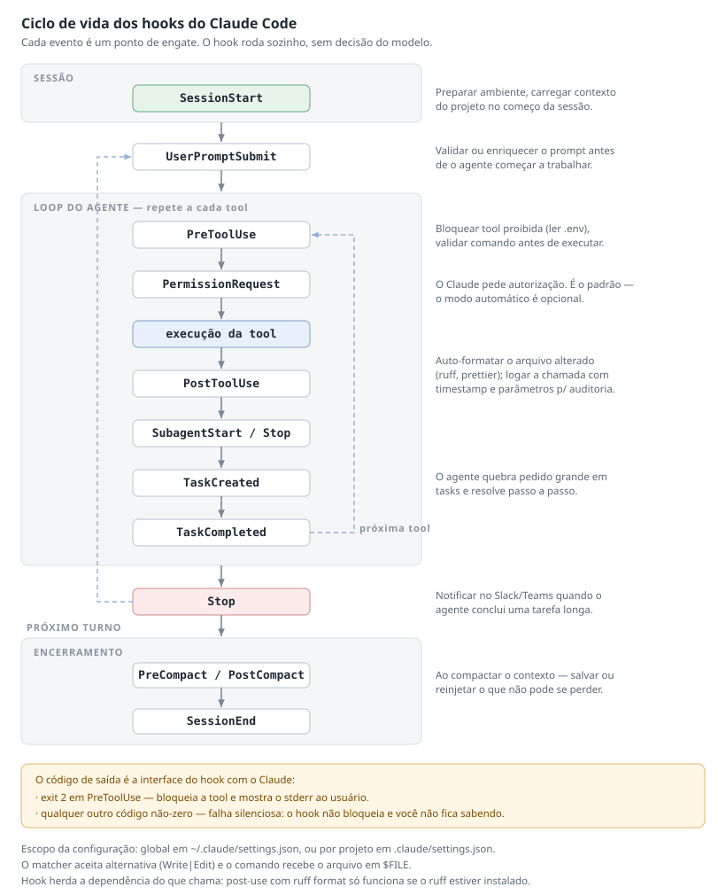

# Resumo — Módulo 9: Intro ao Claude Code

> Subcurso FEA, 3 aulas (~25 min), com Felipe Campos (AI Engineer). Cobre o que é o Claude Code,
> as quatro formas de estender ele (agentes, skills, commands, hooks) e como empacotar e
> distribuir isso via plugins e marketplace.
>
> Referências como `(A01)`, `(A02)`, `(A03)` apontam a aula de origem.

## 1. O que é o Claude Code

Interface de **linha de comando** para trabalhar com o Claude dentro do seu projeto. Integra em
qualquer IDE — VS Code, Databricks, Neovim — e **não exige plugin extra**; também roda direto no
terminal `(A01)`.

O ponto central é o **contexto por diretório**: ele enxerga a árvore de arquivos a partir de onde
foi aberto. Abriu na área de trabalho, tem acesso à pasta e a todas as subpastas — lê e altera
arquivos ali dentro.

Além de ler e escrever, executa shell: roda testes, instala dependências, executa scripts e faz
commit, sem sair do fluxo do terminal.

> **O ambiente é o seu, não dele:** o Claude usa as ferramentas instaladas na sua máquina. Se uma
> skill ou MCP precisa de Docker, Python ou Node.js e você não tem, ele falha e devolve o erro —
> não resolve sozinho `(A02)`.

## 2. Por que Linux importa (e o caminho no Windows)

As ferramentas nativas de leitura de arquivo funcionam bem melhor em Linux, porque executam
comandos que são nativos de lá `(A01)`.

| Situação | Recomendação da aula |
|---|---|
| Máquina Linux (Ubuntu, Arch) | Cenário ideal, tudo funciona |
| Máquina Windows corporativa | Usar **WSL** — mantém tudo num SO só |
| Quer o Linux "de verdade" | Dual boot funciona |
| Vai usar OpenCode | **Só Linux** — não instala no Windows |

O contraponto honesto que a aula faz: o WSL facilita porque unifica o ambiente, mas te obriga a
mexer no Linux só por linha de comando. E isso é apresentado como vantagem no médio prazo —
quem sabe linha de comando entende o que está acontecendo quando algo quebra.

## 3. Os três modelos e quando usar cada um

| Modelo | Perfil | Quando usar |
|---|---|---|
| **Opus** | Topo de linha, faz tudo com excelência, **caro** | Planejar algo que você não conhece |
| **Sonnet** | Intermediário, funciona bem para tudo | Dia a dia |
| **Haiku** | Focado em **velocidade** | Tarefa simples ou que precisa ser rápida |

**Pegadinha:** o Opus não é "o melhor dos mundos" para uso diário justamente por ser caro — ele
consome a sessão rápido. A aula menciona que o plano trabalha em **sessões de 5 horas** de tokens,
então gastar Opus em tarefa trivial encurta seu dia de trabalho `(A01)`.

## 4. Ferramentas nativas

O Claude já vem com um conjunto de tools, e você pode criar outras `(A01)`:

| Tool | Função |
|---|---|
| `read` / `write` / `edit` | Ler arquivo, criar arquivo, editar arquivo já existente |
| `bash` | Executar comando de shell (`ls`, `tree`, `cd`, `mkdir`…) |
| `glob` | Localizar arquivos por padrão na árvore |
| `grep` | Filtrar conteúdo dentro dos arquivos |
| `web search` / `web fetch` | Pesquisar e coletar dados da internet |

Quando não consegue resolver com as tools existentes, ele escreve scripts próprios para dar conta.

## 5. As quatro formas de estender

Esta é a espinha dorsal do subcurso. Os quatro mecanismos parecem próximos, e a diferença entre
eles está em **como são acionados**:

| Mecanismo | O que é | Como é acionado |
|---|---|---|
| **Agente** | Persona especializada num domínio | Você chama, ou o Claude delega |
| **Skill** | Procedimento reutilizável | **Automático** (pelo texto) ou manual via `/` |
| **Command** | Igual à skill na estrutura | **Só manual** — nunca automático |
| **Hook** | Ação que sempre acontece | Disparado por evento do ciclo de vida |

### Agentes

Redirecionam o comportamento do Claude para um domínio **sem trocar o modelo** `(A02)`. Estrutura:
um *front matter* obrigatório e, abaixo dele, a definição em markdown.

```yaml
---
name: analytics-engineer
description: Especialista em transformações dbt, modelagem de dados,
             boas práticas de modelagem e design de camada semântica
model: claude-sonnet-4-6
---

Aqui para baixo é markdown puro: linguagem natural explicando
o que o agente faz, o que ele usa, quais skills ele deve chamar.
```

| Campo | Papel |
|---|---|
| `name`, `description`, `model` | Definem a identidade. O Claude **adota a persona** ao ser invocado |
| Corpo em markdown | Instruções específicas do domínio — dbt, Airflow, Terraform, AWS |

Duas coisas que a aula mostra no slide e não diz em voz alta:

- **Onde o agente mora:** em `agents/` no diretório raiz do plugin. Eles são
  **auto-descobertos** — não precisam ser listados no `plugin.json`.
- **O modelo é por agente.** Pode ser diferente do default: Opus para tarefas complexas,
  Haiku para triagem rápida. Ou seja, a escolha de custo/velocidade da seção 3 vale
  **por agente**, não só por sessão.

Outros agentes do mesmo marketplace, para dar ideia do recorte por domínio:
`data-engineer` (DAGs de Airflow, Databricks, PySpark, pipelines de ingestão),
`data-platform-engineer` (AWS, Azure, CDK, Terraform — infraestrutura como código) e
`project-auditor` (audita conformidade técnica de projeto contra requisitos).

> **O pulo do gato é o encadeamento:** dentro do markdown do agente você aponta quais skills ele
> usa; a skill aponta o script que executa; o script conversa com a API do Databricks e traz dado
> de verdade. Agente → skill → script é a cadeia que transforma prompt em automação real `(A02)`.

A aula é honesta sobre o limite: não há garantia de que um agente "especialista em Airflow" fique
restrito a Airflow — mas na prática observada ele **melhora** naquele domínio.

### Skills

Mesma estrutura do agente, com diferenças no front matter. O que as distingue é a **invocação
automática**: o Claude lê a `description` e ativa a skill sozinho quando o que você pediu se
encaixa `(A02)`.

Por isso a `description` é o campo que mais importa. A boa prática que a aula ensina é escrever
**quando usar e quando NÃO usar** — sem o negativo, a skill dispara fora de hora.

Três formas de acionar:

```
1. Automática  — o Claude decide pela description        ex: "add tests to my models"
2. Direta      — /nome-da-skill + seu prompt             ex: /dbt:tests
3. Só manual   — disable-model-invocation: true          impede a invocação automática
```

Há ainda um quarto campo que refina a decisão: **`when_to_use`**. Ele é o lugar de dizer
em que condição a skill se aplica (por exemplo, *existe `schema.yml` no projeto*) — mais
preciso que empurrar tudo para a `description`.

> **Namespacing evita colisão entre plugins:** skill que vem de plugin é chamada como
> `/nome-do-plugin:nome-da-skill`. É o que permite dois plugins terem uma skill `tests`
> sem conflito.

### Commands

Praticamente iguais às skills, com **uma** diferença que é toda a diferença: **não têm invocação
automática**. Você digita `/`, o nome e executa. Servem para o que você quer disparar
deliberadamente `(A02)`.

**Pegadinha:** skill e command se parecem tanto no arquivo que é fácil escrever um esperando o
comportamento do outro. A régua: se você quer que o Claude decida sozinho, é skill; se você quer
manter o controle do gatilho, é command.

### Hooks

Para o que deve acontecer **sempre**, sem depender da decisão do modelo. O exemplo da aula é
segurança: bloquear a leitura de `.env` por um script bash que intercepta a tentativa `(A02)`.

Os hooks se penduram em eventos nomeados do ciclo de vida:



A configuração vive em `settings.json` — global em `~/.claude/settings.json` ou por projeto
em `.claude/settings.json`:

```json
{
  "hooks": {
    "PreToolUse":  [{ "matcher": "Bash",
                      "hooks": [{ "type": "command", "command": "validate-bash.sh" }] }],
    "PostToolUse": [{ "matcher": "Write|Edit",
                      "hooks": [{ "type": "command", "command": "ruff format $FILE" }] }],
    "Stop":        [{ "hooks": [{ "type": "command", "command": "notify-slack.sh" }] }]
  }
}
```

O `matcher` aceita alternativa (`Write|Edit`) e o comando recebe o arquivo em `$FILE`.

**Pegadinha — o código de saída é a interface do hook com o Claude:** `exit 2` no `PreToolUse`
**bloqueia** a tool e mostra o `stderr` ao usuário. Qualquer outro código não-zero falha em
**silêncio**: não bloqueia nada e você não fica sabendo. Se o seu hook de segurança sai com 1,
ele não está protegendo nada.

**Pegadinha:** o hook de `PostToolUse` com `ruff format` só funciona se o `ruff` estiver instalado
no ambiente. Hook que chama ferramenta externa herda a dependência dela.

Os quatro usos que a aula destaca:

| Uso | Evento | O que faz |
|---|---|---|
| **Validação e bloqueio** | `PreToolUse` | Impede tool proibida (ler `.env`), valida comando |
| **Notificação** | `Stop` | Avisa no Slack/Teams quando o agente conclui tarefa longa |
| **Auditoria** | `PostToolUse` | Loga cada chamada com timestamp e parâmetros, para compliance |
| **Auto-formatação** | `PostToolUse` | Roda `prettier` ou `ruff format` após cada edição |

Sobre o pedido de permissão: por padrão o Claude **pede autorização** antes de executar. Existe um
modo automático que libera, mas ele é opcional — não é o comportamento padrão `(A02)`.

## 6. MCP e LSP

**MCP (Model Context Protocol)** é ao mesmo tempo um conjunto de ferramentas e um **servidor de
tools**. Existem MCPs para praticamente tudo — Notion, Slack, Jira, GitHub — e você pode construir
os seus `(A03)`.

O argumento de economia é direto: o MCP do GitHub foi feito pelo GitHub. Não faz sentido você
escrever chamada de API para gerenciar pull request e criar repositório quando o MCP oficial já
abstrai isso. **Reutilize em vez de reimplementar.**

**LSP (Language Server Protocol)** aparece de passagem: servidores de linguagem dando inteligência
de código em tempo real, sem parsing manual. A aula é transparente ao dizer que o instrutor tem
pouca experiência com isso. A distinção útil que fica: MCP é ferramenta que você invoca; LSP é
contexto contínuo, em tempo real.

## 7. Plugins e marketplace — empacotar e distribuir

Construir é uma coisa; **distribuir para o time** é outra. É o problema que plugins e marketplaces
resolvem `(A01, A03)`.

A motivação é separação por papel: skill de montar slide, skill de dbt para analytics engineer e
skill de Airflow para engenheiro de dados **não devem morar no mesmo lugar**. Cada papel ganha seu
plugin; os plugins ficam no marketplace; cada pessoa instala o que usa.

### Estrutura de um plugin

```
meu-plugin/
├── plugin.json        # name, version, description, author
├── agents/
├── skills/
├── commands/
└── hooks.json         # hooks precisam ser declarados em JSON, na raiz
```

A organização em pastas é boa prática, não obrigação — **exceto os hooks**, que precisam mesmo do
`hooks.json`. O `plugin.json` usa **versionamento semântico**: cada feature nova sobe a versão, e é
isso que permite distribuir atualização de forma controlada.

### O marketplace na prática

O exemplo mostrado tinha **14 plugins, 54 skills e 15 agentes** — plugins de Airflow, AWS, dbt,
Databricks, Terraform, design e um de "commons" com ferramentas genéricas `(A03)`.

> **O plugin de economia de contexto:** um dos mais simples e mais úteis. Um hook **bloqueia** a
> leitura direta de arquivo grande; um script indexa esse arquivo num banco local que simula banco
> vetorial; a busca passa a ser por palavra, e o resultado volta sem o Claude ter lido o arquivo
> inteiro. Troca leitura caras em tokens por consulta baratas `(A03)`.

## 8. Boas práticas de tamanho e composição

Duas regras práticas que a aula extrai da documentação `(A03)`:

| Item | Limite | Por quê |
|---|---|---|
| `CLAUDE.md` | **máx. 500 linhas** | É carregado como contexto do projeto |
| Skill individual | não deixar virar 2500 linhas | Divida e referencie |

A solução para skill grande é **composição**: uma skill referencia outra, que referencia outra,
formando uma árvore de dependências. Isso mantém cada arquivo pequeno e permite reaproveitar peça
em contextos diferentes.

## Conexão com o Desafio Final (dbt + Power BI)

Este subcurso é o mais "meta" dos três — é sobre a ferramenta com que você trabalha, não sobre o
BanVic. Mesmo assim, quatro ligações diretas:

- **`CLAUDE.md` com máximo de 500 linhas** é regra que se aplica a este repositório agora. O
  `AGENTS.md` daqui é o documento longo; o `CLAUDE.md` é o enxuto que aponta para ele — exatamente
  o padrão que a aula recomenda.
- **Agente de analytics engineer** é literalmente o exemplo usado na aula (`transformações dbt,
  modelagem, camada semântica`). O encadeamento agente → skill → script é o que as skills
  `ae-fullflow` e `dbt-packages-tests` deste repo fazem.
- **MCP em vez de chamada de API própria**: o `powerbi-modeling-mcp` configurado no `.mcp.json`
  deste projeto é a aplicação direta do argumento — não escrever integração XMLA à mão.
- **Hook como guardrail**: o bloqueio de `.env` do exemplo é o mesmo mecanismo que resolveria, de
  forma automática, os guardrails de Power BI que hoje vivem como texto no `AGENTS.md` (nunca
  remover background, fechar o Desktop antes de editar TMDL). Texto depende de o agente ler; hook
  não depende.

Uma ressalva de escopo: o guardrail de dados deste projeto continua valendo. Skill, agente e MCP
só com dado de treino ou com autorização explícita do cliente.
